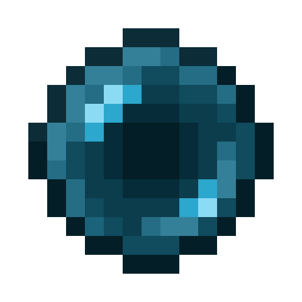

  

<h1 align="center">Minecraft Pearl Bot (Fabric)</h1>

<h3>About Pearl Bot</h3>

This is a Fabric mod that can control my ender pearl chamber bot via in-game commands.

<h4>Video Example:</h4>

<h3>Usage</h3>
<ol>
  <li>Clone the <a href="https://github.com/kreivon/PearlBot">bot repository</a> into your Minecraft install</li>
  <li>Run <code>npm install</code> to fetch required dependencies</li>
  <li>Copy the file <code>default_config.json</code> and rename it to <code>config.json</code></li>
  <li>Edit <code>config.json</code> to add account logins <a href="https://github.com/PrismarineJS/mineflayer?tab=readme-ov-file#echo-example">as done with Mineflayer</a>, and specify chamber coordinates using the test world as an example</li>
  <li>Run the bot in-game:  
  <code>/pearl &lt;chamberId&gt; &lt;pearlId&gt;</code>
</ol>

<h3>Credits</h3>
<ul>
  <li><b>Kreivon</b> | Writing the mod and Mineflayer bot</li>
</ul>
